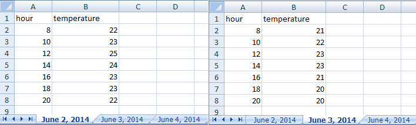
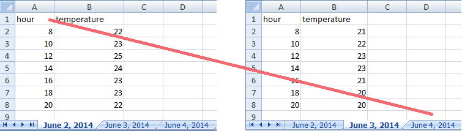

# Formatting data tables in Spreadsheets #

Authors:**Christie Bahlai**, **Aleksandra Pawlik** 
Contributors: **Jennifer Bryan**, **Alexander Duryee**, **Jeffrey Hollister**, **Daisie Huang**, **Owen Jones**, and
**Ben Marwick**

The most common mistake a casual spreadsheet user makes is by treating the program like it is a lab notebook- that is, relying on context, notes in the margin, spatial layout of data and fields to convey information. As humans, we can (usually) interpret these things, but computers are dumb, and unless we explain to the computer what every single thing means, it will not be able to see how our data fit together.

This is why it’s extremely important to set up well-formatted tables from the outset- before you even start entering data from your very first preliminary experiment. Spreadsheets are powerful because they allow us to connect things that relate to each other in a  machine-readable way. Failing to use this functionality is essentially the same as scanning your datasheets and saving them as jpegs- digitally backed up, but not really doing anything for anybody. When you don’t set up your spreadsheet in a way which allows the computer to see how things are connected, you’re either creating a lot of work for you or for someone else, or dooming your data to obscurity.
There are two simple rules you should keep in mind when entering your data into any spreadsheet:

1. Each data cell is an observation that must have all the relevant information connected to it for it to stand on its own.

2. You must make it clear to the computer how the data cells relate to the relevant information and each other.

So, you can see how these two points apply directly to how you set up your spreadsheets. 

The rule of thumb, when setting up a datasheet, is columns= variables, rows = observations, cells=data (values).
Let's try this with an example using some of our sample data: [a list of species](../../../data/biology/species.csv) and [a list of plots](../../../data/biology/plots.csv). You can do that by simply opening the `*.csv` files in Excel. Excel will automatically try to fit the data from the `*.csv` file and put the first value in column A and the second value in column B. 

The output should look like this:

A common grad student error I’ve seen is creating multiple data tables within one spreadsheet. NEVER DO THIS. When you create multiple tables within one spreadsheet, you’re drawing false associations between things for the computer, which sees each row as an observation. You’re also potentially using the same field name in multiple places, which will make it harder to clean your data up into a usable form. The example below depicts the problem:

But what about worksheet tabs? That seems like an easy way to organize data, right? Well, yes and no. When you create extra tabs, you fail to allow the computer to see connections in the data that are there. Say, for instance, you make a separate tab for each day you take a measurement.
<!---
#
-->

This is bad practice for two reasons: 1) you are more likely to accidentally add inconsistencies to your data if each time you take a measurement, you start recording data in a new tab, and 2) even if you manage to prevent all inconsistencies from creeping in, you will add an extra step for yourself before you analyze the data because you will have to combine these data into a single datatable. You will have to explicitly tell the computer how to combine tabs- and if the tabs are inconsistently formatted, you might even have to do it by hand!

The next time you’re entering data, and you go to create another tab or table, I want you to ask yourself “Self, could I avoid adding this tab by adding another column to my original spreadsheet?”

Your data sheet might get very long over the course of experiment. This makes it harder to enter data if you can’t see your headers at the top of the spreadsheet. But do NOT repeat headers. These can easily get mixed into the data, leading to problems down the road.

[Show an example of how to freeze panes in Excel]

Previous: [Introduction](00-intro.md)  Next: [Common formatting mistakes by spreadsheet users.](02-common-mistakes.md)
