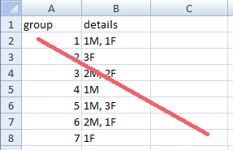
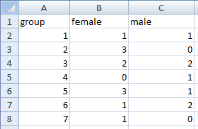

## Common mistakes by spreadsheet users

Authors:**Christie Bahlai**, **Aleksandra Pawlik** 
Contributors: **Jennifer Bryan**, **Alexander Duryee**, **Jeffrey Hollister**, **Daisie Huang**, **Owen Jones**, and
**Ben Marwick**

## Not filling in zeroes ##
-example: when entering count data for a community, nonzero observations may be rare- why bother if they’re mostly zeroes?
Spreadsheets and statistical programs will likely mis-interpret blank cells that are meant to be zero. This is equivalent to leaving out data. Zero observations are real data! Leaving zero data blank is not good in a written lab notebook, but NEVER okay when you move your data into a digital format

[create an example of this in Excel]
## Using bad null values ##
-example: using -999 or other numerical values (or zero)
Many statistical programs will not recognize that numeric values of null are indeed null. It will depend on the final application of your data and how you intend to analyse it, but it is essential to use a clearly defined and CONSISTENT null indicator. Blanks (most applications) and NA (for R) are good choices.

From White et al, 2013, Nine simple ways to make it easier to (re)use your data. Ideas in Ecology and Evolution:

## Using formatting to convey information ##
 Example: highlighting cells, rows or columns that should be excluded from an analysis, leaving blank rows to indicate separations in data
	solution: create a new field to encode which data should be excluded

[create an example of this in Excel]

## Using formatting to make the data sheet look pretty ##
Example: merging cells 
If you’re not careful, formatting a worksheet to be more aesthetically pleasing can compromise your computer’s ability  to see associations in the data. Merged cells are an absolute formatting NO-NO if you want to make your data readable by statistics software.  Consider restructuring your data in such a way that you will not need to merge cells to organize your data

[create an example of this in Excel]

## Placing comments or units in cells ##
Example: your data was collected, in part, by a summer student you later found out was mis-identifying some of your species, some of the time. You want a way to note these data are suspect.
Solution: most statistical programs can’t see Excel’s comments, and would be confused by comments placed within your data cells. Create another field if you need to add notes to cells. Similarly, don’t include units- ideally, all the measurements you place in one column should be in the same unit, but if for some reason they aren’t, create another field and specify the units the cell is in.

[create an example of this in Excel]

## More than one piece of information in a cell ##
Example: you find one male, and one female of the same species. You enter this as 1M, 1F.
Solution: Never, ever, EVER include more than one piece of information in a cell. If you need both these measurements, design your data sheet to include this information.

## Field name problems ##
Choose descriptive field names, but be careful not to include: spaces, numbers, or special characters of any kind. Spaces can be misinterpreted and some programs don’t like field names that are text strings that start with numbers.

[work through good examples of field names]

##Special characters in data ##

A common mistake is to treat Excel as a word processor when writing notes.  For example, when writing longer text in a cell, people often include line breaks, em-dashes, et al in their spreadsheet.  Worse yet, when copying data in from applications such as Word, formatting and fancy non-standard characters (such as left- and right-aligned quotation marks) are included.  When exporting this data into a coding/statistical environment or into a relational database, dangerous things may occur, such as lines being cut in half and encoding errors being thrown.

General best practice is to avoid adding characters such as newlines, tabs, and vertical tabs.  In other words, treat a text cell as if it were a simple web form that can only contain text and spaces.

[ include sample of problematic data, and cleaned version ]

Previous: [Formatting data tables in spreadsheets.](01-format-data.md) Next: [Dates as data.](03-dates-as-data.md)
