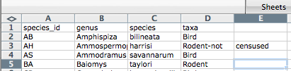

# Caveats of popular data and file formats #

Materials by: **Jeffrey Hollister**, **Alexander Duryee**, **Jennifer Bryan**, **Daisie Huang**, **Ben Marwick**, **Christie Bahlai**, **Owen Jones**, **Aleksandra Pawlik**

###Commas as part of data values in `*.csv` files

In the [previous lesson](05-exporting-data.md) we discussed how to export Excel file formats into `*.csv`. Whilst Comma Separated Value files are indeed very useful allowing for easily exchanging and sharing data. 

However, there are some significant problems with this particular format. Quite often the data values themselves may include commas (,). In that case, the software which you use (including Excel) will most likely incorrectly display the data in columns. It is because the commas which are a part of the data values will be interpreted as a delimiter.

For example, our data could look like this:
	
		species_id,genus,species,taxa
		AB,Amphispiza,bilineata,Bird
		AH,Ammospermophilus,harrisi,Rodent-not,censused
		AS,Ammodramus,savannarum,Bird

In record `AH,Ammospermophilus,harrisi,Rodent-not,censused` the value for *taxa* includes a comma (`Rodent-not,censused`). 
If we try to read the above into Excel (or other spreadsheet programme), we will get something like this:

The value for 'taxa' was split into two columns (instead of being put in one column `D`). This can propagate to a number of further errors. For example, the "extra" column will be interpreted as a column with many missing values (and without a proper header!). In addition to that, the value in column `D` for the record in row 3 (so the one where the value for 'taxa' contained the comma) is now incorrect. 
 

### Dealing with commas as part of data values in `*.csv` files

If you want to store your data in `*.csv` and expect that your data may contain commas in their values, you can avoid the problem discussed above by putting the values in quotes (""). This [example data file](../../../data/biology/species.csv) applies this rule so the actual data looks like:

	species_id,genus,species,taxa
	"AB","Amphispiza","bilineata","Bird"
	"AH","Ammospermophilus","harrisi","Rodent-not censused"
	"AS","Ammodramus","savannarum","Bird"
	"BA","Baiomys","taylori","Rodent"
	"CB","Campylorhynchus","brunneicapillus","Bird"
	"CM","Calamospiza","melanocorys","Bird"
	"CQ","Callipepla","squamata","Bird"
	"CS","Crotalus","scutalatus","Reptile"
	"CT","Cnemidophorus","tigris","Reptile"
	"CU","Cnemidophorus","uniparens","Reptile"
	
This original file does not contain commas in the values. 

But let's see what would happen if we introduced a comma into  `"Rodent-not censused"` - so that it looks like this: `"Rodent-not, censused"`. 

1. Open the [species.csv](../../../data/biology/species.csv) file in Excel (or Calc in Libre Office).
2. Add the comma (,) in `"Rodent-not censused"`.
3. Save the file under a **different name** (but also in the `csv` format) and reopen it in Excel.
4. The issue with the "extra" incorrect column should not appear.

However, if you are working with already existing dataset in which the data values are not included in "" and but which have commas as both delimiters and parts of data values, you are potentially facing a major problem with **data cleaning**.

If the dataset you're dealing with contains hundreds or thousands of records, cleaning them up manually (by either removing commas from the data values or putting the values into quotes - "") is not only going to take hours and hours but may potentially end up with you accidentally introducing many errors.

Cleaning up datasets is one of major problems in many scientific disciplines. The approach almost always depends on the particular context. However, it is a good practice to clean the data in an automated fashion, for example by writing and running a script. Other lessons in Data Carpentry covering shell, Python and R will give you the basis for developing skills to build relevant scripts.

###Tab Separated Values format

###Other delimiters for data formats

Previous: [Exporting data from spreadsheets.](05-exporting-data.md)