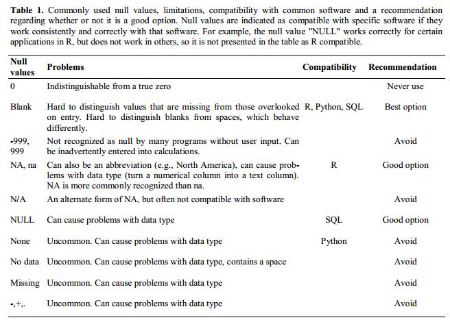
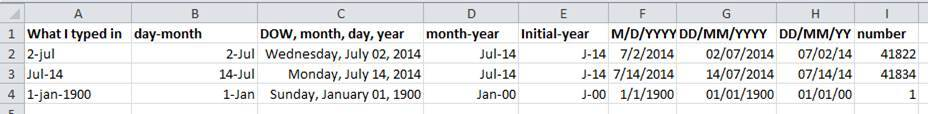
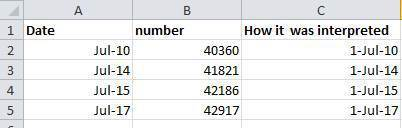
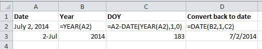

# Using spreadsheet programs for scientific data #

Spreadsheet programs are use very useful graphical interfaces for designing data tables and handling very basic data quality control functions. 

The cardinal rules of using spreadsheet programs for data:

	1. Put all your variables in columns
	2. Put each observation in its own row
	3. Don’t @#$%! with it
	4. Export to CSV.

In reality, though, many scientists use spreadsheet programs for much more than this. We use them to create data tables for publications, to generate summary statistics, and make figures. 
Generating tables for publications in a spreadsheet is not optimal- often, when formatting a data table for publication, we’re reporting key summary statistics in a way that is not really meant to be read as data, and often involves special formatting (merging cells, creating borders, making it pretty). We advise you to do this sort of operation within your document editing software.

The latter two applications,  generating statistics and figures,  should be used with caution: because of the graphical, drag and drop nature of spreadsheet programs, it can be very difficult, if not impossible, to replicate your steps (much less retrace anyone else's), particularly if your stats or figures require you to do more complex calculations. Furthermore, in doing calculations in a spreadsheet, it’s easy to accidentally apply a slightly different formula to multiple adjacent cells. When using a command-line based statistics program like R or SAS, it’s practically impossible to accidentally apply a calculation to one observation in your dataset but not another unless you’re doing it on purpose. 

HOWEVER, there are circumstances where you might want to use a spreadsheet program to produce “quick and dirty” calculations or figures, and some of these features can be used in data cleaning, prior to importation into a statistical analysis program. We will show you how to use some features of spreadsheet programs to check your data quality along the way and produce preliminary summary statistics.

In this lesson, we will assume that you are most likely using Excel as your primary spreadsheet program- there are others (gnumeric, Calc from OpenOffice), and their functionality is similar, but Excel seems to be the program most used by biologists and ecologists.

In this lesson, we’re going to talk about:

    Formatting data tables in spreadsheets.
    Common formatting mistakes by spreadsheet users
    Dates as data
    Basic quality control and data manipulation in spreadsheets
    Exporting data from spreadsheets

# Formatting data tables in Spreadsheets #

The most common mistake a casual spreadsheet user makes is by treating the program like it is a lab notebook- that is, relying on context, notes in the margin, spatial layout of data and fields to convey information. As humans, we can (usually) interpret these things, but computers are dumb, and unless we explain to the computer what every single thing means, it will not be able to see how our data fit together.

This is why it’s extremely important to set up well-formatted tables from the outset - before you even start entering data from your very first preliminary experiment. Spreadsheets are powerful because they allow us to connect things that relate to each other in a  machine-readable way. Failing to use this functionality is essentially the same as scanning your datasheets and saving them as jpegs- digitally backed up, but not really doing anything for anybody. When you don’t set up your spreadsheet which allows the computer to see how things are connected, you’re either creating a lot of work for you or for someone else, or dooming your data to obscurity.
There are two simple rules you should keep in mind when entering your data into any spreadsheet:

Each data cell is an observation that must have all the relevant information connected to it for it to stand on its own.

You must make it clear to the computer how the data cells relate to the relevant information and each other.

So, you can see how these two points apply directly to how you set up your spreadsheets. 

The rule of thumb, when setting up a datasheet, is columns= fields, rows = observations, cells=data (values).
Let's try this with an example using some of our sample data: [a list of species](../../data/biology/species.csv) and [a list of plots](../../data/biology/plots.csv). You can do that by simply opening the `*.csv` files in Excel. Excel will automatically try to fit the data from the `*.csv` file and put the first value in column A and the second value in column B. 

The output should look like this:

A common grad student error I’ve seen is students that create multiple data tables within one spreadsheet. NEVER DO THIS. When you create multiple tables within one spreadsheet, you’re drawing false associations between things for the computer, which sees each row as an observation. You’re also potentially using the same field name in multiple places, which will make it harder to clean your data up into a usable form.

[create an example of this in Excel]

But what about worksheet tabs? that seems like an easy way to organize data, right? Well, yes and no. When you create extra tabs, you fail to allow the computer to see connections in the data that are there. Say, for instance, you make a separate tab for each day you take a measurement. 

[create an example of this in Excel]

This is bad practice for two reasons: 1) you are more likely to accidentally add inconsistencies to your data if each time you take a measurement, you start recording data in a new tab, and 2) even if you manage to prevent all inconsistencies from creeping in, you will add an extra step for yourself before you analyze the data because you will have to combine these data into a single datatable. You will have to explicitly tell the computer how to combine tabs- and if the tabs are inconsistently formatted, you might even have to do it by hand!

The next time you’re entering data, and you go to create another tab or table, I want you to ask yourself “Self, could I avoid adding this tab by adding another column to my original spreadsheet?”

Your data sheet might get very long over the course of experiment. This makes it harder to enter data if you can’t see your headers at the top of the spreadsheet. But do NOT repeat headers. These can easily get mixed into the data, leading to problems down the road.

[Show an example of how to freeze panes in Excel]

# Common mistakes by spreadsheet users #
## Not filling in zeroes ##
-example: when entering count data for a community, nonzero observations may be rare- why bother if they’re mostly zeroes?
Spreadsheets and statistical programs will likely mis-interpret blank cells that are meant to be zero. This is equivalent to leaving out data. Zero observations are real data! Leaving zero data blank is not good in a written lab notebook, but NEVER okay when you move your data into a digital format

[create an example of this in Excel]
## Using bad null values ##
-example: using -999 or other numerical values (or zero)
Many statistical programs will not recognize that numeric values of null are indeed null. It will depend on the final application of your data and how you intend to analyse it, but it is essential to use a clearly defined and CONSISTENT null indicator. Blanks (most applications) and NA (for R) are good choices.

From White et al, 2013, Nine simple ways to make it easier to (re)use your data. Ideas in Ecology and Evolution:

## Using formatting to convey information ##
 Example: highlighting cells, rows or columns that should be excluded from an analysis, leaving blank rows to indicate separations in data
	solution: create a new field to encode which data should be excluded

[create an example of this in Excel]

## Using formatting to make the data sheet look pretty ##
Example: merging cells 
If you’re not careful, formatting a worksheet to be more aesthetically pleasing can compromise your computer’s ability  to see associations in the data. Merged cells are an absolute formatting NO-NO if you want to make your data readable by statistics software.  Consider restructuring your data in such a way that you will not need to merge cells to organize your data

[create an example of this in Excel]

## Placing comments or units in cells ##
Example: your data was collected, in part, by a summer student you later found out was mis-identifying some of your species, some of the time. You want a way to note these data are suspect.
Solution: most statistical programs can’t see Excel’s comments, and would be confused by comments placed within your data cells. Create another field if you need to add notes to cells. Similarly, don’t include units- ideally, all the measurements you place in one column should be in the same unit, but if for some reason they aren’t, create another field and specify the units the cell is in.

[create an example of this in Excel]

## More than one piece of information in a cell ##
Example: you find one male, and one female of the same species. You enter this as 1M, 1F.
Solution: Never, ever, EVER include more than one piece of information in a cell. If you need both these measurements, design your data sheet to include this information.

[create an example of this in Excel]

## Field name problems ##
Choose descriptive field names, but be careful not to include: spaces, numbers, or special characters of any kind. Spaces can be misinterpreted and some programs don’t like field names that are text strings that start with numbers.

[work through good examples of field names]

## Dates as data ##
Spreadsheet programs have numerous “useful features” which allow them to “handle” dates in a variety of ways.

But these ‘features’ often allow ambiguity to creep into your data. Ideally, data should be as unambiguous as possible. The first thing you need to know is that Excel stores dates as a number- see the last column in the above figure. Essentially, it counts the days from a default of December 31, 1899, and thus stores July 2, 2014 as  the serial number 41822.

(But wait. That’s the default on my version of Excel. We’ll get into how this can introduce problems down the line later in this lesson. )

This serial number thing can actually be useful in some circumstances. Say you had a sampling plan where you needed to sample every thirty seven days. In another cell, you could type:
    
    =B2+37
    
And it would return

    8-Aug

because it understands the date as a number 41822, and 41822 +37 =41859 which Excel interprets as August 8, 2014. It retains the format (for the most part) of the cell that is being operated upon, (unless you did some sort of formatting to the cell before, and then all bets are of)

Which brings us to the many ‘wonderful’ customizations Excel provides in how it displays dates. If you refer to the figure above, you’ll see that there’s many, MANY ways that ambiguity creeps into your data depending on the format you chose when you enter your data, and if you’re not fully cognizant of which format you’re using, you can end up actually entering your data in a way that Excel will heavily misinterpret.

Once, I received a dataset from a colleague representing insect counts that were taken every few days over the summer, and things went something like this:

If Excel was to be believed, my colleague had been collecting bugs IN THE FUTURE. Now, I have no doubt this person is highly capable, but I believe time travel was beyond even his grasp.

Thus, in dealing with dates in spreadsheets, we recommend separating date data into separate fields, which will eliminate any chance of ambiguity. 

In my own work, I tend to store my dates in two fields: year, and day of year (DOY). Why? Because this is what’s useful to me, and there is practically no possibility for ambiguity creeping in.

The types of statistical models I build usually incorporate year as a factor, to account for year-to-year variation, and then I use DOY to measure the passage of time within a year. 

So, can you convert all your dates into DOY format? Well, in excel, here’s a handy dandy guide:

[Exercise: pulling month out of Excel dates]

# Basic quality control and data manipulation in spreadsheets #

When you have a well-structured data table, you can use several simple techniques within your spreadsheet to ensure the data you’ve entered is free of errors. 

*Tip! before doing any quality control operations, ensure your data is stored as “values” and not as formulas.  Because formulas refer to other cells, and you may be moving cells around, you may compromise the integrity of your data if you do not take this step!

[Example: converting all data to values: use soybean aphid suction trap dataset for this section]

## Sorting ##
Bad values often sort to bottom or top of column. Sort your data by each field, one at a time. Scan through each column, but pay the most attention to the top and the bottom of a column. 
If your dataset is well-structured and does not contain formulas, sorting should never affect the integrity of your dataset.

[Example: sorting]

## Conditional formatting ##
 Use with caution! But a great way to flag inconsistent values when entering data.

[Example: conditional formatting]

## Check on cell formats ##
A good way to check if you’ve got data of the wrong type in a column is by checking column format. This can also help prevent issues when you export your data.

[Example: variable format]

## Pivot tables ##
Pivot tables are a very powerful tool in Excel. They’re useful to check for issues with data integrity because they provide a quick, visual way to spot things that are amiss, including with categorical variables. They are also great for reshaping data and obtaining summary statistics quickly in a drag and drop interface.

[Example in Pivot Table]

Why would I need to reshape my data? Different analyses require data to be in different formats- example: taking a species list to a diversity analysis.

[Use species list example]

Note: these operations can be done in most statistical or programming packages (i.e. using reshape2, plyr  in R)

# Exporting data from spreadsheets #
Storing data in Excel is a bad idea. Why? Because it is a proprietary format, and it is possible that in the future, technology won’t exist (or will become sufficiently rare)  to make it inconvenient, if not impossible, to open the file. 

Think about zipdisks. How many old theses in your lab are “backed up” and stored on zipdisks? Ever wanted to pull out the raw data from one of those?
Exactly.

But more insidious- different versions of Excel may be changed so they handle data differently, leading to inconsistencies.

As an example, do you remember how we talked about how Excel stores dates earlier? Turns out there are multiple defaults for different versions of the software. And you can switch between them all willy-nilly. So… say you’re compiling Excel-stored data from multiple sources. There’s dates in each file- Excel interprets them as their own internally consistent serial numbers. When you combine the data, Excel will take the serial number from the place you’re importing it from, and interpret it using the rule set for the version of Excel you’re using. Essentially, you could be adding a huge error to your data, and it wouldn’t necessarily be flagged by any data cleaning methods if your ranges overlap.

Storing data in a universal, open, static format will help deal with this problem. Try tab-delimited (ok) or csv (best). Most spreadsheet programs can do this easily, although they complain and make you feel like you’re doing something wrong along the way.

[Walk through an example of saving an Excel file to CSV]

An important note for backwards compatibility: you can open CSVs in Excel!

A cautionary note on Excel for Mac- apparently, there are some issues that can occur in certain versions when you attempt to save to .csv on a Mac- specifically, the line endings generate problems for several statistical problems and coding environments. The GUI-based workaround is to save the file as a “Windows comma separated (.csv)” file. A code-based work-around can be found here:
http://nicercode.github.io/blog/2013-04-30-excel-and-line-endings/

